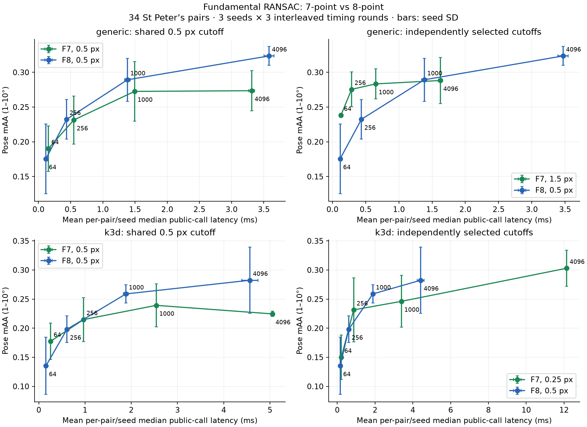
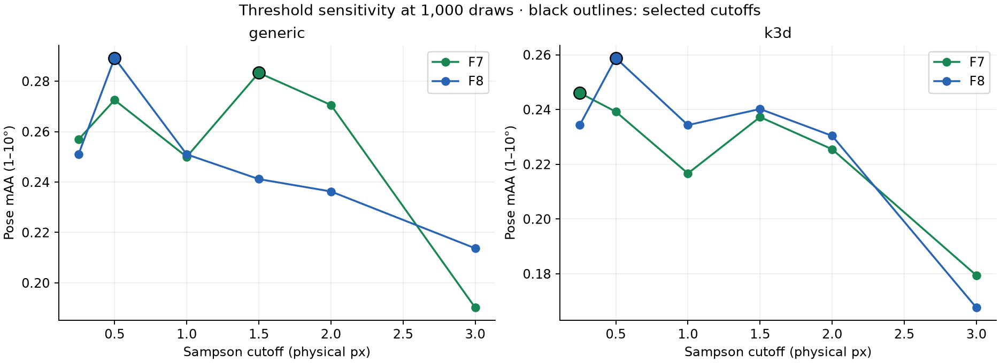

# Seven-point fundamental RANSAC evaluation

**Historical measurements.** The same-threshold curves below predate the
shared nonminimal-refit and sampling-bound fixes. Use the
[corrected evaluation at confidence 0.999999](accuracy-audit/README.md)
for the current implementation; the original measurements remain here for auditability.

Measured on 2026-10-07, Apple M1 (macOS arm64), release Rust build, CPU only.
This is the F-only follow-up to [issue #1165](https://github.com/kornia/kornia-rs/issues/1165).

The later [solver optimization and local reference checks](optimization/README.md)
report faster fitting/scoring and the repeated-root correctness fix.

## Implementation

`pose::fundamental_7point` Hartley-normalizes exactly seven matches, obtains a two-dimensional null space with stack-based Householder QR, and solves the determinant cubic. It returns every distinct real rank-two solution, including the projective solution at infinity when the polynomial degree drops. Degenerate, non-finite and rank-one configurations are rejected. The standard multi-solution construction is also described in [OpenCV's fundamental solver source](https://github.com/opencv/opencv/blob/4.x/modules/calib3d/src/fundam.cpp).

The generic `FundamentalEstimator` now samples seven matches and scores all roots. Its inlier refinement retains normalized eight-point fitting for eight or more matches, and supports a seven-match refit. `Fundamental8PointEstimator` retains the original generic implementation. The pose-stack `ransac_fundamental` also uses seven-point hypotheses and s=7 adaptive stopping; `ransac_fundamental_8point` retains its previous path. Both paths share their existing scoring/refinement code.

Python exposes `solver="7point"` (default) and `solver="8point"` on `ransac.fundamental` and `k3d.find_fundamental(method=8)`. The generic threshold is squared pixels; k3d takes pixels. Direct `find_fundamental(method=0)` still uses eight-point fitting. The k3d minimum support remains 8 by default; explicitly pass `min_inliers=7` for exactly seven matches.

The complete two-view pose pipeline keeps its existing `Fundamental8ptSolver` default. Rust callers can opt into `Fundamental7ptSolver` through the builder.

## Measurement protocol

- The same 34 St Peter's Square RootSIFT pairs and SNN ≤ 0.85 matches as issue #1165. Match order is preserved; input-file and selected-content hashes are in `results.json`.
- Three seeds (0, 1, 2), three interleaved timing repetitions. Each reported latency is the mean of per-pair/seed public-call medians, including input conversion inside the Rust binding and FFI overhead. Python input staging, warmup, compilation and quality evaluation are excluded. OpenCV uses four threads; these RANSAC calls are serial.
- Pose mAA uses strict 1–10° thresholds on max(rotation error, sign-invariant translation error), recovering pose with OpenCV from the returned matrix and inliers. Failures count as misses. Generic confidence is 0.999; the existing k3d confidence is 0.9999. Local optimization is disabled as in the original benchmark; generic final inlier refitting remains enabled by the existing driver.
- Sweep physical pixel cutoffs [0.25, 0.5, 1, 1.5, 2, 3] at 1,000 draws, independently select each variant's highest-mAA cutoff, then fix it at budgets [64, 256, 1000, 4096]. Also run all variants at the same 0.5 px cutoff to isolate solver behavior.
- Equal draw caps do not imply equal work: F7 can score up to three models per draw. Actual generic draw counts are reported; the k3d public API does not expose them. Threshold selection is in-sample on this one dataset, and three seeds do not establish significance or generalize to other scenes.

## Findings

Generic F7 offers a useful low-latency option after threshold selection: at 1,000 draws it achieves **0.2833 mAA / 0.651 ms**, versus F8 **0.2892 / 1.382 ms**. At 64 and 256 draws F7 has higher measured mAA. At 4,096 draws F8 reaches **0.3235**, versus F7 **0.2882**; F7 is faster (**1.624 vs 3.469 ms**). The F7 cutoff is 1.5 px, versus F8's 0.5 px, so this latency improvement includes earlier stopping at the larger cutoff.

At the shared 0.5 px cutoff, generic F7 loses accuracy at the larger budgets: **0.2735 vs 0.3235 mAA** at 4,096 draws, with **3.311 vs 3.580 ms** latency. It uses fewer draws, but scores more models per draw. Thus F7 is not a universal speed or accuracy improvement over the existing implementation.

For k3d, independently tuned F7 at 4,096 draws reaches **0.3029 mAA**, versus F8 **0.2824**, but costs **12.139 vs 4.414 ms**. Its selected cutoff is 0.25 px, versus F8's 0.5 px. At the shared 0.5 px cutoff, F7 instead reaches **0.2245 / 5.055 ms**, versus F8 **0.2824 / 4.565 ms**.

All F7 calls returned scorable models. F8 k3d had four failed pair/seed cases at 64 draws, repeated in both threshold modes; other configurations had none. Raw results contain 5,712 uniquely covered configurations and 17,136 timed calls.





## Independently selected thresholds

| Engine | Solver | Cutoff (px) | Draw cap | Pose mAA | Mean latency (ms) | Mean draws used |
|---|---|---:|---:|---:|---:|---:|
| generic | F7 | 1.5 | 64 | 0.2382 | 0.128 | 55.3 |
| generic | F8 | 0.5 | 64 | 0.1755 | 0.116 | 64.0 |
| generic | F7 | 1.5 | 256 | 0.2755 | 0.289 | 146.7 |
| generic | F8 | 0.5 | 256 | 0.2324 | 0.436 | 252.4 |
| generic | F7 | 1.5 | 1,000 | 0.2833 | 0.651 | 368.0 |
| generic | F8 | 0.5 | 1,000 | 0.2892 | 1.382 | 835.7 |
| generic | F7 | 1.5 | 4,096 | 0.2882 | 1.624 | 991.5 |
| generic | F8 | 0.5 | 4,096 | 0.3235 | 3.469 | 2259.5 |
| k3d | F7 | 0.25 | 64 | 0.1500 | 0.217 | — |
| k3d | F8 | 0.5 | 64 | 0.1353 | 0.156 | — |
| k3d | F7 | 0.25 | 256 | 0.2314 | 0.868 | — |
| k3d | F8 | 0.5 | 256 | 0.1980 | 0.608 | — |
| k3d | F7 | 0.25 | 1,000 | 0.2461 | 3.394 | — |
| k3d | F8 | 0.5 | 1,000 | 0.2588 | 1.886 | — |
| k3d | F7 | 0.25 | 4,096 | 0.3029 | 12.139 | — |
| k3d | F8 | 0.5 | 4,096 | 0.2824 | 4.414 | — |

## Shared 0.5 px threshold

| Engine | Solver | Cutoff (px) | Draw cap | Pose mAA | Mean latency (ms) | Mean draws used |
|---|---|---:|---:|---:|---:|---:|
| generic | F7 | 0.5 | 64 | 0.1902 | 0.154 | 64.0 |
| generic | F8 | 0.5 | 64 | 0.1755 | 0.116 | 64.0 |
| generic | F7 | 0.5 | 256 | 0.2314 | 0.549 | 239.9 |
| generic | F8 | 0.5 | 256 | 0.2324 | 0.437 | 252.4 |
| generic | F7 | 0.5 | 1,000 | 0.2725 | 1.494 | 719.5 |
| generic | F8 | 0.5 | 1,000 | 0.2892 | 1.382 | 835.7 |
| generic | F7 | 0.5 | 4,096 | 0.2735 | 3.311 | 1744.5 |
| generic | F8 | 0.5 | 4,096 | 0.3235 | 3.580 | 2259.5 |
| k3d | F7 | 0.5 | 64 | 0.1775 | 0.255 | — |
| k3d | F8 | 0.5 | 64 | 0.1353 | 0.155 | — |
| k3d | F7 | 0.5 | 256 | 0.2147 | 0.967 | — |
| k3d | F8 | 0.5 | 256 | 0.1980 | 0.609 | — |
| k3d | F7 | 0.5 | 1,000 | 0.2392 | 2.541 | — |
| k3d | F8 | 0.5 | 1,000 | 0.2588 | 1.883 | — |
| k3d | F7 | 0.5 | 4,096 | 0.2245 | 5.055 | — |
| k3d | F8 | 0.5 | 4,096 | 0.2824 | 4.565 | — |

## Focused Rust microbenchmarks

`cargo bench -p kornia-3d --bench bench_fundamental -- --quick` used deterministic nonplanar pinhole correspondences, 500 matches, seed 0 and a 1,000-draw cap. The solver microbenchmark uses seven/eight clean correspondences; the RANSAC benchmark is noise-free except for uniformly random outliers. These quick timings are diagnostic, and are separate from the real-data pose-quality results. The shared 1,000-draw cap is inadequate at 20% inliers: these timings do not check recovery and cannot establish an F7/F8 runtime ranking at equal success probability. See [the corrected matched-confidence comparison](optimization/README.md).

| Case | F7 | F8 |
|---|---:|---:|
| Minimal solver | 0.814 µs | 1.208 µs |
| RANSAC, 20% inliers | 4.207 ms | 2.262 ms |
| RANSAC, 50% inliers | 3.383 ms | 2.123 ms |
| RANSAC, 80% inliers | 0.133 ms | 0.110 ms |

The minimal F7 solve is cheaper, while multi-root scoring outweighs that saving in these synthetic RANSAC cases. Full Criterion output is in `criterion.log`.

## Validation and reproduction

Passed 32 focused fundamental-matrix Rust tests, nine generic RANSAC driver tests, three fundamental doctests, and seven Python tests. Clippy passed for kornia-3d's library/tests/new benchmark and kornia-py's library with warnings denied; formatting and diff checks passed. **No full Rust, Python, C++ or workspace suite was run.** CUDA and x86 SIMD were not tested on this arm64 CPU.

The retained F8 paths were compared against the original release extension built from `a18f4931749a5a53b7e93834cf29f3261c0614f8`: all **204** outputs (34 pairs × three seeds × two engines, 0.5 px / 1,000 draws) matched exactly, including matrices, masks and exposed iteration counts. The issue's original generic mAA is reproduced exactly (0.2892156863 at 1,000 and 0.3235294118 at 4,096). Latencies are fresh measurements rather than values copied from the issue.

`results.json` records every pair/seed/variant/budget/cutoff, raw timings, pose error, support, failures, generic iterations, package versions and source/binary hashes. `validation.json` records coverage and check results. Figures are also available as editable SVGs.

From this checkout, with the precomputed tutorial dataset available locally:

```bash
RANSAC_DATA_ROOT=/path/to/tutorial-data bash docs/fundamental-7pt/reproduce.sh
```

The script builds the current wheel in a fresh `/tmp` environment, runs only the focused tests and F7/F8 benchmarks, and prints its result directory. No other RANSAC models or external backends are evaluated.
