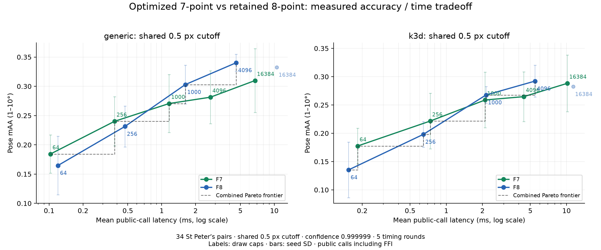
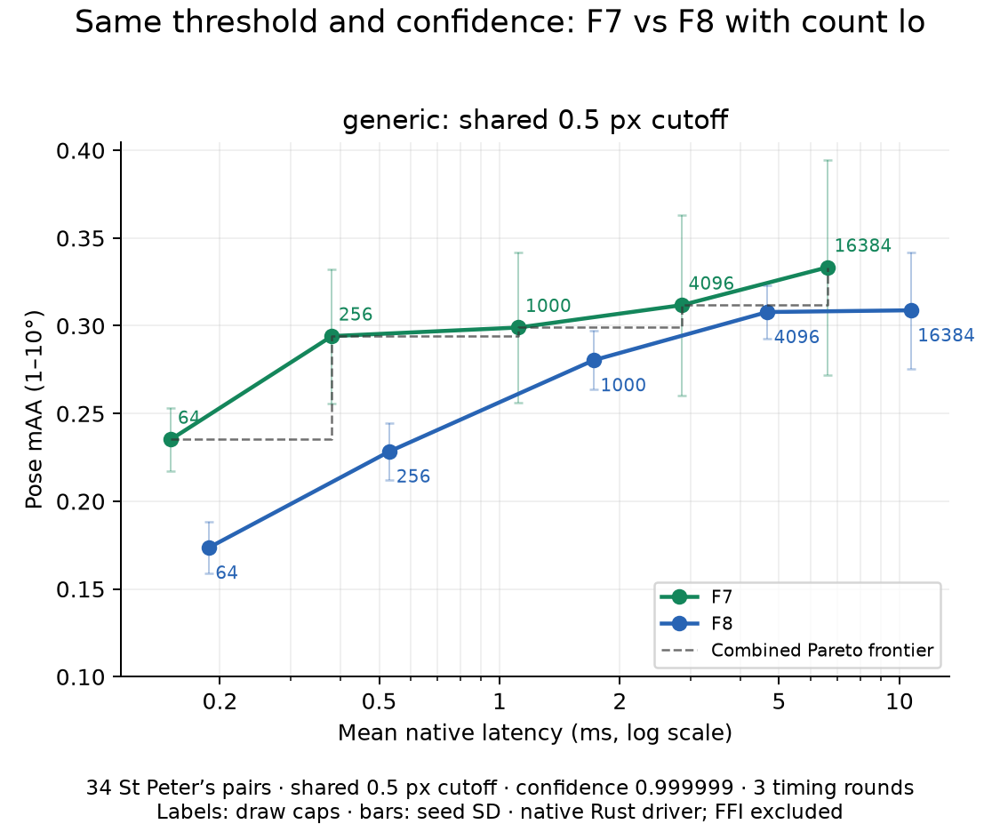

# Fundamental solver accuracy audit (work in progress)

The current comparison uses **confidence 0.999999 and the same 0.5 px threshold for F7 and F8**. This supersedes the historical curves in the original and optimization reports. Measured on Apple M1, macOS arm64, release builds, 2026-10-07.

## Correctness fixes

- The old nonminimal eight-point path used only the first eight constraints for sets of 9–64 matches. It now fits all matches.
- The old three inverse iterations did not reliably find the smallest eigenvector for noisy full-rank systems. A full stack-based symmetric eigendecomposition replaces them. Finite and rank-deficiency guards reject invalid fits.
- Both adaptive RANSAC paths used `w^k` although their uniform samples contain distinct indices. They now use `p = product((I-j)/(N-j), j=0..k-1)` and stable log arithmetic. For N=10, I=8, k=8, the requested confidence requires 615 draws rather than the previous 76.

The sampling bound is exact given the estimated inlier set. A draw cap can prevent reaching the target, and estimated support can contain false positives. The cap remains a sampling target rather than a guarantee of correct pose.

## Public APIs, existing refinement settings

34 St Peter's Square pairs, identical SNN ≤0.85 matches, seeds 0/1/2, five interleaved timing rounds, draw caps 64/256/1000/4096/16384. Latency is the mean of per-pair/seed medians including FFI; pose recovery is excluded. Generic uses hard-count scoring, no iterative local optimization, and the corrected final inlier refit. Python k3d keeps `refit=false`, as in issue #1165. No threshold tuning is included.



| Engine | Cap | F7 ms / pose mAA | F8 ms / pose mAA |
|---|---:|---:|---:|
| generic | 64 | 0.103 / 0.1843 | 0.120 / 0.1647 |
| generic | 256 | 0.381 / 0.2402 | 0.471 / 0.2314 |
| generic | 1,000 | 1.165 / 0.2706 | 1.620 / 0.3029 |
| generic | 4,096 | 2.707 / 0.2814 | 4.580 / 0.3402 |
| generic | 16,384 | 6.736 / 0.3098 | 10.495 / 0.3324 |
| k3d | 64 | 0.183 / 0.1775 | 0.154 / 0.1353 |
| k3d | 256 | 0.735 / 0.2216 | 0.644 / 0.1980 |
| k3d | 1,000 | 2.104 / 0.2588 | 2.140 / 0.2676 |
| k3d | 4,096 | 4.411 / 0.2647 | 5.459 / 0.2922 |
| k3d | 16,384 | 10.150 / 0.2882 | 11.347 / 0.2824 |

Plain hard-count RANSAC still shows an observed quality gap at larger budgets. Correcting the refit and stopping calculation does not remove it. These measurements do not establish that the seven-point minimal arithmetic is incorrect.

## Common local refinement control

Both solvers use the same generic Rust driver, confidence, threshold, sampler and `lo_every=1`. This setting refits promising models during the loop. The production defaults are unchanged. Three alternating native timing rounds exclude FFI; these times must not be mixed with the public-call panel.



| Cap | F7 native ms / pose mAA | F8 native ms / pose mAA |
|---:|---:|---:|
| 64 | 0.151 / 0.2353 | 0.187 / 0.1735 |
| 256 | 0.381 / 0.2941 | 0.531 / 0.2284 |
| 1,000 | 1.117 / 0.2990 | 1.720 / 0.2804 |
| 4,096 | 2.856 / 0.3118 | 4.673 / 0.3078 |
| 16,384 | 6.613 / 0.3333 | 10.679 / 0.3088 |

F7 has higher measured mAA and lower latency at every common-LO draw cap. This is a controlled comparison under that policy, not a claim that LO is the best policy for F8 or that F7 dominates every configuration. In particular, F8 without LO reaches higher peak mAA in the public panel. Bars show seed SD; these small-sample means are not a significance claim.

## Scoring and stopping controls

All six policies at 4,096 draws are shown below. Count is hard support; MSAC scores the sum of `1 - residual / threshold` for inliers. Fixed means all 4,096 draws are consumed. Its diagnostic consensus suppresses adaptive count updates while retaining the true score and mask. It also bypasses bounded scoring, so these single-pass timings are diagnostic throughput measurements, not the headline runtime comparison.

| Policy | F7 pose mAA | F8 pose mAA |
|---|---:|---:|
| count_adaptive | 0.2814 | 0.3402 |
| count_fixed | 0.3206 | 0.3520 |
| count_lo | 0.3118 | 0.3078 |
| msac_adaptive | 0.2853 | 0.3137 |
| msac_fixed | 0.3314 | 0.3137 |
| msac_lo | 0.3225 | 0.3059 |

No single stopping or ranking change eliminates every difference. The controls show that refinement and ranking affect the selected pose, so an end-to-end pose curve cannot isolate minimal solver arithmetic.

## Reference and regression checks

The [minimal solver checks against local pydegensac and Kornia](../optimization/README.md#comparison-with-local-pydegensac-and-kornia) remain applicable: all 1,000 real seven-match samples agree up to scale/sign. The 102 winning F7 sample sets traced from the earlier suspect 4,096-draw curve also match Kornia; worst projective distance is 2.1e-12 (`winner-references.json`). Those traced samples predate the current stopping fix; this check isolates minimal arithmetic rather than claiming identical final models.

All current native policy outputs have consistent scalar Sampson masks, finite matrices and rank-two outputs (maximum σ3/σ1 below 1e-16); timing repetitions return identical matrices, masks and draw counts.

Focused validation: 44 fundamental tests, 31 two-view tests, adaptive-cap regressions, 9 Python solver tests and 4 fundamental doctests passed. `cargo clippy -p kornia-3d -p kornia-py --no-deps --lib --tests --bench bench_fundamental -- -D warnings`, formatting and diff checks passed. No full test suite was run, as requested.

API compatibility: adding `RansacParams.confidence` requires exhaustive Rust literals to add `confidence: None` or `..Default::default()`. Python `k3d.find_fundamental` accepts a keyword-only confidence override; the Python two-view solver classes retain their historical defaults.

## Reproduction

Build/install the current release Python wheel, then run:

```bash
python kornia-py/benchmarks/bench_fundamental_solvers.py \
  --data-root "$HOME/dev/pydegensac/benchmarks/data" \
  --json /tmp/fundamental-public-results.json \
  --stages matched --confidence 0.999999 --matched-threshold 0.5 \
  --budgets 64,256,1000,4096,16384 --rounds 5
python kornia-py/benchmarks/plot_fundamental_pareto.py \
  --json /tmp/fundamental-public-results.json --out-dir /tmp/fundamental-public-plot
bash docs/fundamental-7pt/accuracy-audit/reproduce_policies.sh
```

The native script accepts `PYTHON_EXEC`, `DATA_ROOT` and `CARGO_TARGET_DIR`. Its Python environment needs NumPy, h5py, OpenCV and Matplotlib. Scratch builds and results stay under `/tmp`. `public-results.json`, `lo/count_lo.json`, `controls/*.json`, `pareto.json` and compressed native raw outputs retain the rows, hashes and observed frontiers.

## Low-inlier matched-confidence comparison

500 matches, 100 known clean inliers, 0.5 px, five seeds, target confidence **0.999999**, alternating solver order. The exact oracle experiment consumes each solver's own budget; `confidence=1.0` is used only to disable early stopping in that fixed-budget control. The normal adaptive experiment uses `confidence=0.999999` and a nonbinding 15-million-draw cap. Both recover all 100 true inliers in all five seeds.

| Comparison | F7 median | F8 median | Speedup | F7 median draws | F8 median draws |
|---|---:|---:|---:|---:|---:|
| Exact oracle sampling probability 0.999999 | 3.105 s | 14.108 s | **4.54×** | 1,282,564 | 6,798,998 |
| Normal adaptive confidence 0.999999 | 3.068 s | 13.746 s | **4.48×** | 1,282,564 | 6,798,998 |

`confidence-results.json` retains each run's recovery, support, draw count, all-inlier draw count, projective error and exact sampling probability. Five runs verify recovery on these inputs; they do not estimate an empirical 99.9999% success rate. Reproduce with `bash docs/fundamental-7pt/accuracy-audit/reproduce_confidence.sh`.

## Ongoing work

Further speed/quality work remains, including the plain hard-count pose-quality gap and the minimal-kernel timing gap to pydegensac's C solver. This report accompanies a draft PR, not a readiness claim.
