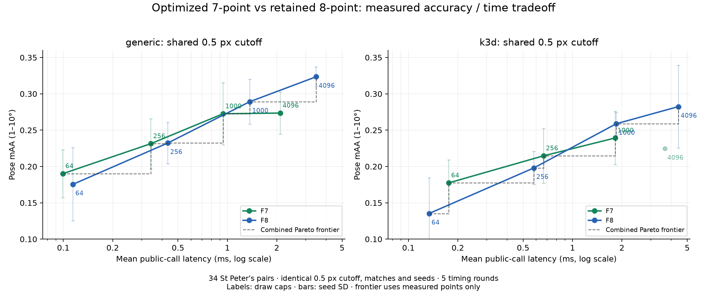

# Seven-point solver optimization and reference checks

The latest [scoring optimization](scoring/README.md) improves the dedicated F7
public path by 1.45–1.75× on the recorded real pairs, with exact output checks
across 2,040 cases. The measurements below describe the earlier optimization.

**The historical Pareto curve below is superseded by the
[corrected confidence-0.999999 evaluation](../accuracy-audit/README.md).**
That audit fixes shared nonminimal fitting and the without-replacement
stopping probability. The before/after optimization and minimal-reference
measurements here describe the earlier frozen builds, whose results are preserved.

Measured on 2026-10-07 on Apple M1, macOS arm64, release builds. This follows
[the original F7/F8 comparison](../README.md). No PR, commit or push was made.

## Results

The public minimal solver is **0.488 µs**, down from **0.762 µs** (1.56× faster),
and approximately twice as fast as the retained eight-point solver. Seven-point
generic RANSAC improves by **1.33–2.15×** on the focused synthetic cases.

On the same 34 real pairs, at 1,000 draws and a shared 0.5 px threshold, generic
F7 improves from **1.480 to 0.940 ms** (1.57×), and k3d F7 from **2.516 to
1.818 ms** (1.38×). All **5,712 configurations** retain exactly the same inlier
masks and exposed iteration counts, projectively equivalent matrices
(unit-Frobenius, up to sign, `rtol=1e-8`, `atol=1e-10`), and identical pose mAA.
Eight-point latency controls remain within about 1% in the fixed-budget synthetic runs.
At 20% inliers with matched 99% sampling probability, F7 is **4.49× faster
than F8**, with both recovering all true inliers in five of five seeds (details below).

The pydegensac native C minimal kernel is still faster than Rust on the
one- and three-root real samples below. The optimization does not claim to
beat every solver or to improve pose accuracy on this dataset.

## Implementation

- RANSAC calls a fixed three-model output buffer; roots and hypotheses stay on
  the stack, with no allocation in minimal fitting. The public Vec API stays compatible.
- Seven constant QR steps specialize the existing NEON/AVX2 reflector kernels.
  Analytic reflector norms avoid a second pass, and pivot columns are not transformed again.
- Fast norms retain a scaled fallback for extreme values. Candidate matrices
  are built and validated one at a time. Sparse Hartley denormalization avoids general matrix products.
- Cardano uses one cube root or one sine/cosine pair. Newton polishing stops
  at the polynomial's rounding-error floor. A better projective pencil handles
  small leading determinants and repeated/infinite roots while preserving original root ordering.
- F7 scoring processes SIMD-aligned chunks and rejects only when the unscored
  suffix cannot beat the incumbent. Generic scoring uses a count bound; k3d
  additionally uses the nonnegative accumulated-error bound for ties. These
  checks preserve the threshold arithmetic and accumulation order. Custom
  consensus, SPRT, local optimization and F8 retain their existing scoring paths.
- AVX2+FMA kernels now require both CPU features at dispatch.

## Fixed-budget Rust benchmarks

Three alternating before/after rounds, 30 Criterion samples per case,
0.5 s warmup and 1 s measurement. Entries are medians of the three estimates.
The benchmark binary was frozen before optimization. RANSAC uses 500 matches,
seed 0 and a 1,000-draw cap. Input generation and thresholds are identical.

| Case | Before F7 | Optimized F7 | F8 control | F7 speedup |
|---|---:|---:|---:|---:|
| Minimal fit | 0.762 µs | 0.488 µs | 0.960 µs | 1.56× |
| 20% inliers | 3.078 ms | 2.306 ms | 1.957 ms | 1.33× |
| 50% inliers | 2.618 ms | 1.413 ms | 1.977 ms | 1.85× |
| 80% inliers | 106.220 µs | 49.441 µs | 84.413 µs | 2.15× |

These are fixed-budget throughput measurements, not equal-success solver comparisons.
At 20% inliers, 1,000 draws give approximately 1.27% sampling success for F7
and 0.256% for F8 under the usual `w^k` approximation. The benchmark did not check
recovery and gives the solvers different sampling reliability. Inferring that
F8 wins at low inlier rates from these times was incorrect. The sampling advantage must be measured with adequate,
solver-specific budgets and verified recovery; see the corrected comparison below.

## Same-threshold Pareto curve

Both solvers use **0.5 px**, identical matches and seeds; only the draw cap
varies (64, 256, 1,000, 4,096). This plot uses the optimized public-call timings
already recorded in `results.json`. Identical F8 configurations appearing under
both threshold-mode labels are pooled per pair/seed before taking timing
medians. No separately tuned thresholds enter this comparison.



The dashed frontier contains configurations that no other measured setting
beats in both speed and pose mAA. Error bars show variation across the three
seeds; the frontier is based on means, without a statistical significance claim.

| Generic draw cap | F7 time / mAA | F8 time / mAA |
|---|---:|---:|
| 64 | 0.100 ms / 0.1902 | 0.115 ms / 0.1755 |
| 256 | 0.341 ms / 0.2314 | 0.434 ms / 0.2324 |
| 1,000 | 0.940 ms / 0.2725 | 1.370 ms / 0.2892 |
| 4,096 | 2.098 ms / 0.2735 | 3.479 ms / 0.3235 |

On these 34 real pairs, optimized generic F7 provides better low-latency
settings, while F8 reaches a higher observed pose mAA at larger budgets.
F7's 4,096-draw setting is dominated by F8's 1,000-draw setting. This measured
pose-quality tradeoff does not negate seven-point's all-inlier sampling
advantage: candidate ranking, adaptive stopping, refinement and scene
structure also affect the selected pose. The peak-quality gap remains present
in this evaluation; solver optimization preserved the previous matrices and
quality rather than resolving it.

Reproduce the plot and exact frontier points with:

```bash
python kornia-py/benchmarks/plot_fundamental_pareto.py \
  --json docs/fundamental-7pt/optimization/results.json \
  --out-dir docs/fundamental-7pt/optimization
```

`pareto.svg` is editable, and `pareto.json` records all same-threshold points
and frontiers. This uses the existing focused measurements; no test suite or
new threshold sweep was run to generate the curve.

## Corrected low-inlier comparison

The earlier statement that F8 can win at low inlier ratios was unsupported and
is retracted. A shared 1,000-draw cap discards the seven-point sampling advantage.
For 20% inliers and 99.9% confidence, the standard `w^k` bound requires **539,665
F7 draws versus 2,698,339 F8 draws**. Comparing their cost at 1,000 draws does
not compare runtime at equal confidence.

The corrected native experiment uses the same 500-match scene, 100 true
inliers, 1 px threshold, five seeds and alternating solver order. Exact
without-replacement per-draw probabilities determine separate budgets for
**99% probability of at least one all-inlier sample**. Adaptive stopping is kept
above these oracle budgets, and the recorded draw counts confirm both consume
their entire budgets. Recovery is checked against the known true inlier mask.

| Comparison | F7 median | F8 median | F7 speedup | F7 draws | F8 draws | Recovery |
|---|---:|---:|---:|---:|---:|---|
| Matched 99% sampling probability | 0.966 s | 4.336 s | **4.49×** | 427,522 | 2,266,333 | Both 5/5 runs recover all 100 true inliers |
| Normal adaptive stopping, confidence 0.999 | 1.140 s | 4.768 s | **4.18×** | 503,355 | 2,491,871 | Both 5/5 runs recover all 100 true inliers |

The adaptive experiment gives both solvers a nonbinding five-million-draw cap;
its conventional observed-inlier stopping estimate is approximate. The exact
oracle-budget experiment is the primary matched-probability comparison. Five
runs verify recovery on these inputs; they do not estimate a 99% empirical
success rate. Output support, projective distances and all-inlier draw counts
are retained in `confidence-results.json`. The recovered masks can include one
or two incidental outliers, which affect the final least-squares refinement.

The 1,000-draw pilot recovered all true inliers in 4/5 F7 runs and 2/5 F8 runs,
even though neither solver drew an all-inlier sample in those pilot runs. Mixed
samples can produce an adequate model, so low all-inlier probability alone does
not prove a run failed; checking output quality was essential.

A read-only audit found no sample-size or stopping-exponent defect: both drivers
use 7 or 8 distinct indices, score every real root, count iterations per sample,
and use the matching exponent. The error was in the comparison and its
interpretation. The Criterion benchmark now labels the old group
`fundamental_ransac_fixed_budget` and adds `fundamental_ransac_equal_confidence`
with solver-specific budgets and recovery assertions. A focused `cargo bench`
run passes those assertions and independently measures 0.988 s for F7 versus
4.365 s for F8 (4.42×); its quick estimates are in `confidence-criterion.json`.

Reproduce the corrected native experiment with:

```bash
bash docs/fundamental-7pt/optimization/reproduce_confidence.sh
```

## Real-data public-call timings

Five same-process A/B rounds alternate the saved original extension and the
optimized extension. The cutoffs, match order, seeds, confidence and draw
budgets are frozen from the previous experiment; no retuning occurs. Values
are means of per-pair/seed timing medians, including the existing FFI/input
conversion. Pose recovery is outside the timed region. Full rows and all
budgets are in `results.json`.

| Engine | Frozen F7 cutoff | Budget | Before | Optimized | Speedup | Pose mAA |
|---|---:|---:|---:|---:|---:|---:|
| Rust generic F7 (matched) | 0.5 px | 1,000 | 1.480 ms | 0.940 ms | 1.57× | 0.2725 |
| Rust generic F7 (matched) | 0.5 px | 4,096 | 3.186 ms | 2.098 ms | 1.52× | 0.2735 |
| Rust generic F7 (tuned) | 1.5 px | 1,000 | 0.647 ms | 0.412 ms | 1.57× | 0.2833 |
| Rust generic F7 (tuned) | 1.5 px | 4,096 | 1.629 ms | 1.063 ms | 1.53× | 0.2882 |
| Rust k3d F7 (matched) | 0.5 px | 1,000 | 2.516 ms | 1.818 ms | 1.38× | 0.2392 |
| Rust k3d F7 (matched) | 0.5 px | 4,096 | 4.853 ms | 3.657 ms | 1.33× | 0.2245 |
| Rust k3d F7 (tuned) | 0.25 px | 1,000 | 3.376 ms | 2.633 ms | 1.28× | 0.2461 |
| Rust k3d F7 (tuned) | 0.25 px | 4,096 | 12.393 ms | 9.566 ms | 1.30× | 0.3029 |

## Comparison with local pydegensac and Kornia

Source comparison used `~/dev/pydegensac` and `~/dev/kornia`. All use the same
`x2ᵀ F x1 = 0` design and determinant constraint. Pydegensac uses raw-coordinate
partial-pivot Gauss–Jordan null vectors and Cardano. Rust uses Hartley
normalization and an orthonormal QR basis. Kornia normalizes and conditions the
projective pencil; that conditioning also informed the Rust repeated-root fix.

The C harness extracts `nullspace`, `slcm` and `rroots3` directly from current
source, with hashes in `c-sources.json`; it does not time Python ctypes calls.
It preserves pydegensac's mutated-basis reconstruction. An additional wrapper
adds Hartley normalization, denormalization and unit-Frobenius output for a
closer work comparison. Rust's estimator benchmark reuses its output Vec;
the public API includes its result allocation. Native loops use compiler
barriers, 200,000 fits per round, seven alternating rounds. Kornia runs prepared
float64 CPU tensors, one Torch thread, and includes PyTorch dispatch, so its
single-fit timings are not a direct measure of just its arithmetic kernel.

| Real sample | Rust reusable output | Rust public Vec | C raw coordinates | C + Hartley/output norm | Kornia single fit |
|---|---:|---:|---:|---:|---:|
| 1 real root(s) | 0.467 µs | 0.486 µs | 0.351 µs | 0.376 µs | 568.8 µs |
| 3 real root(s) | 0.558 µs | 0.580 µs | 0.366 µs | 0.408 µs | 564.0 µs |

Solution sets are compared up to scale/sign, independently of root order:

- All 1,000 real seven-match samples agree with current-source raw pydegensac
  and Kornia within projective distance `1e-6`; Rust and Kornia match in both directions.
- All 1,000 synthetic samples, with independent similarities spanning scales
  `1e-3`–`1e4`, agree with Kornia and Hartley-normalized C. Raw C has 161 candidate
  discrepancies on these extreme transforms; no Rust candidate fails the residual/rank checks.
- Kornia's singular-pencil fixture exposed a missing repeated root in the
  original Rust implementation. The optimized solver keeps both distinct
  projective solutions; it now agrees with both references. This is covered by a Rust regression.
- The artificial normalized C wrapper disagrees on one real sample (#705),
  while raw C, Rust and Kornia agree. Investigation found a well-conditioned
  design (condition number 23.7) but LU basis norms 198 and 1,626. Cardano
  cancellation leaves a C candidate with normalized determinant about `1e-8`,
  at projective distance `5.1e-5`. Rust/Kornia agree within `3.94e-13`.
  `reference-outlier.json` records the diagnosis, and a normalized Rust fixture
  guards against this loss of rank-two accuracy. The C wrapper is a diagnostic,
  not an infallible correctness oracle.

## Validation and reproduction

Passed 38 focused fundamental Rust tests, including the real-reference regression,
11 driver tests, three bounded-scorer tests, four relevant doctests, seven Python
tests, focused Clippy with warnings denied, formatting and diff checks. No full
Rust/Python/workspace suite was run. SIMD execution was checked on arm64; x86
and CUDA execution remain unverified. Read-only reviews found no remaining defects.

To reproduce the native reference checks/timings using the local Kornia Torch environment:

```bash
KORNIA_ROOT="$HOME/dev/kornia" PYDEGENSAC_ROOT="$HOME/dev/pydegensac" \
  bash docs/fundamental-7pt/optimization/reproduce_native.sh
```

The script builds only the focused probe and C kernels in a fresh `/tmp`
directory. It uses the saved 1,000 real minimal samples and prints its outputs.
Override `TORCH_PYTHON` or `CARGO_TARGET_DIR` as needed.

For public-call A/B reproduction, preserve the original extension before
installing an optimized wheel, then run:

```bash
python kornia-py/benchmarks/bench_fundamental_optimization.py \
  --before /tmp/saved-before.so --after /tmp/optimized-after.so \
  --data-root "$HOME/dev/pydegensac/benchmarks/data" \
  --reference docs/fundamental-7pt/results.json --json /tmp/optimization.json
```

`results.json`, `criterion.json`, `minimal-times.json`, `references.json` and
source/binary hashes retain the measurement evidence. `confidence-results.json`
records the corrected low-inlier comparison. The previous experiment's
measurement data remain unchanged; the report now corrects the interpretation
of fixed-budget timings. This directory contains the optimization follow-up.
